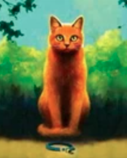
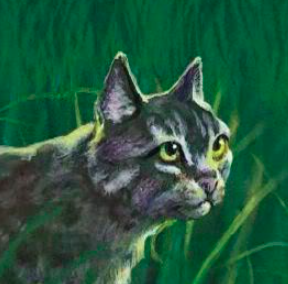
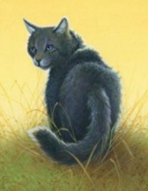
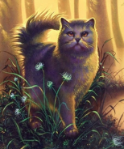
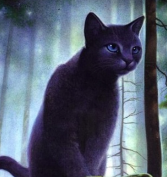
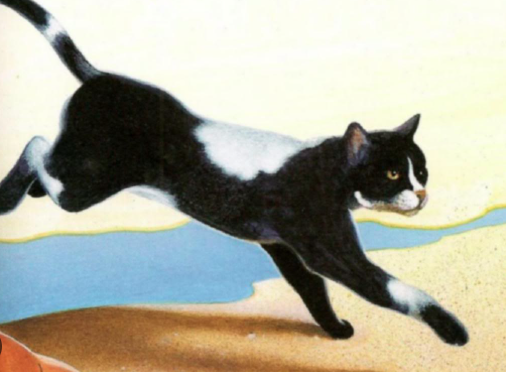
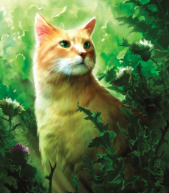

# Bienvenue sur mon Blog pour parler de La Guerre des Clans.

--------

C'est un super roman écrit par le collectif d'auteur *Erin Hunter*.  
Et ça parle de **Chat** !  
Enfin un roman c'est peu dire, il y a 5 cycles de 6 tomes chacuns, ainsi que plusieurs hors séries.  
 
Je les aient lus dans mes jeunes années jusqu'au cycle III, mais aujourd'hui je les relis !  
Pour l'instant j'en suis au tome III du cycle I.  
Ce blog est donc fait pour vous offrir mes réactions en direct, quelle chance vous avez ! 
 
Ce blog sera organisé par cycle, ici vous trouverez des informations générales. Bonne lecture ! 
## Les chats que j'aime le plus
 
**Rusty** aka **Nuage de feu** aka **Coeur de feu** aka **Etoile de feu** :  
Prévisible me direz vous. Mais en même temps c'est le sang (enfin du coup non, vu que le sang du clan ne coule pas dans ses veines mais vous avez compris). 
J'ai beau être une gonzesse je m'identifie trop à lui ! Bon je suis pas rousse, mais je devrais peut-être me faire une couleur pour lui ressembler... 
Quand j'étais au collège (moment où j'ai lu les livres pour la première fois) c'est lui qui m'a appris qu'en vrai se faire bolosser c'était pas si grave et c'était pas une raison pour pas essayer d'aider les autres quand même.  
C'est aussi lui qui m'a donné envie de combatre l'injustice ! Bon au final je l'ai jamais fait, mais j'en avais envie. 
 
 
**Nuage gris** aka **Plume grise** : 
Déjà c'est le premier à avoir accepté Nuage de feu malgré sa différence. Et comme moi je suis trop différente beh ça m'a trop touchée ! 
Je sais pas pourquoi dans ma tête je l'associe trop à Ron dans Harry Potter, je pense ça vient du caractère un peu beunet. 
Le passage où il parle plus à coeur de feu parce qu'il voit Rivière d'argent m'avait mis trop mal quand j'étais jeune et innocente... En vrai il m'a mis mal aujourd'hui aussi, malgré mes rides. 
 
 
**Nuage Cendré** aka **Museau Cendré** : 
La première apprentie de Coeur de feu, elle est adorable avec son enthousiasme débordant. Juste elle me stresse un peu à jamais écouter son mentor. 
Ca me rend trop triste qu'elle puisse pas devenir guerrière, mais sa relation avec Croc jaune est trop touchante ! Déjà que j'adore la vieille chatte, après l'accident de Nuage cendré sur le chemin du tonnerre ça l'a rend encore plus cool. 
Elle est gentille et sait trouver les mots, donc je l'aime voilà. 
 
 
**Croc Jaune** : 
Bon du coup sans suprise vu que je l'ai déjà dit. C'est marrant parce que la première fois que je l'ai lu à ce moment là des livres (début du tome III du cyle I) j'étais plus attachée à Etoile bleue qu'à Croc Jaune, mais aujourd'hui je suis plus attachée à l'ancienne guerrisseuse du Clan de l'Ombre. 
J'aime bien son côté aigrie, je crois que je m'identifie beaucoup plus à elle maintenant que la vie m'a rendu amer également. Après tout aujourd'hui je suis une vieille chatte, alors qu'à l'époque j'étais encore une apprentie pleine d'entrain ! 
Je n'ai jamais lu le hors série "Le secret de Croc jaune" mais j'ai vraiment très envie de le lire maintenant, son histoire avec Etoile grise et Etoile brisée doit être boulverssante ! Vu comment j'ai chialé mes grands mort quand j'ai lu la prophétie d'Etoile bleue, je sens que la lecture du Secret de Croc jaune ça va être quelque chose...  
 
 
**Etoile bleue** : 
Encore une transition de génie pour parler d'un des personnage cher à mon coeur ! Déjà c'est la meilleure cheffe de clan, elle est juste et réfléchie, sauf quand elle nomme Griffe de Tigre lieutenant (mais on pardonne). 
En soit dans la série principale elle est bien mais on voit clairement pas son plein potentiel. Heureusement le hors série "La prophétie d'Etoile bleue" existe pour rétablir la vérité. Si vous ne l'avez jamais lu, lisez le, même si vous avez jamais lu un tome de La Guerre des Clans ! 
Je pense que c'est mon personnage préféré grace à ce hors série, j'ai plus pleuré en lisant ce livre que pour la mort de ma grand-mère, c'est dire (pour ma défense je lis lentement, donc forcément ça m'a fait chialer sur le long terme). 
 
 
**Etoile fliante** : 
Premier chat qui n'est pas du Clan du tonnerre ! J'ai pas trop d'argument du coup, juste je trouve que c'est un bon chef de clan, voilà. 
 
 
**Nuage de sable** aka **Tempête de sable** : 
Il me semble que je l'aimais trop quand j'étais petite, mais en vrai pour l'instant je la juge un peu. La meuf est clairement raciste, et elle arrête de l'être qu'à partir du moment où Coeur de feu lui sauve la vie. 
Abusé un peu en vrai. Mais il me semble qu'elle devient vraiment cool par la suite, d'où sa présence dans cette liste. 
  